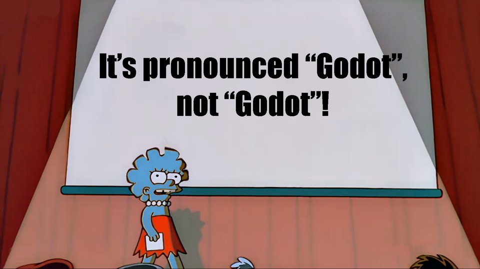

# Aussprache

> Ähm wie spricht man "Godot" eigentlich aus?

Diese Frage habe ich schon sehr oft gehört oder gelesen. Insbesondere unter Youtubevideos findet man öfter heiße Diskussionen darüber. Die Antwort ist einfacher als man denkt: Es ist eure Sache, wie ihr "Godot" aussprecht - es ist eine freie und offene Spieleengine und ihr könnt entscheiden, was ihr damit macht. Somit könnt ihr auch entscheiden, wie ihr es aussprechen wollt. Das hat Juan Linietsky - auch _reduz_ genannt - mal in einem Interview klargestellt. Und er ist neben Ariel Manzur der Begründer und Hauptentwickler von Godot.

Zwei Beispiele, wie man es aussprechen kann:

- [GOH-DOH](../assets/godoh.m4a) ... Diese Variante ist häufig und entspricht der französischen Aussprache. Sie wurde vor allem durch _Nathan_ von [GDQuest](https://www.gdquest.com/) - ein bekannter Youtuber und der Hauptverantwortliche der offiziellen Godot-Dokumentation - verbreitet.
- [GO-DOTT](../assets/godot.m4a) ... Diese Variante mit dem betonten T am Ende entspricht der Aussprache von [_reduz_](https://twitter.com/reduzio), welcher in Argentinien lebt.
- [JO-DOU](../assets/jodou.m4a) ... Das G zu Beginn ausgesprochen wie der Name Joe und der Rest wie das englische Dough (wie in Donut). 

Macht euch also keine Gedanken darüber. Sprecht es aus wie ihr wollt 🤷‍♂️. Frei nach dem Motto:

(Bildquelle: u/meloonicscorp, 11.11.2020, https://www.reddit.com/r/godot/comments/jsc8qm/for_the_last_time/)