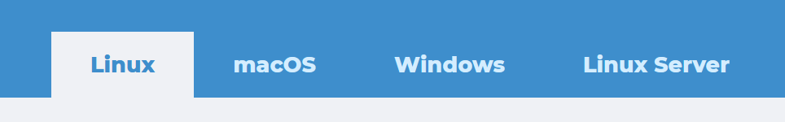
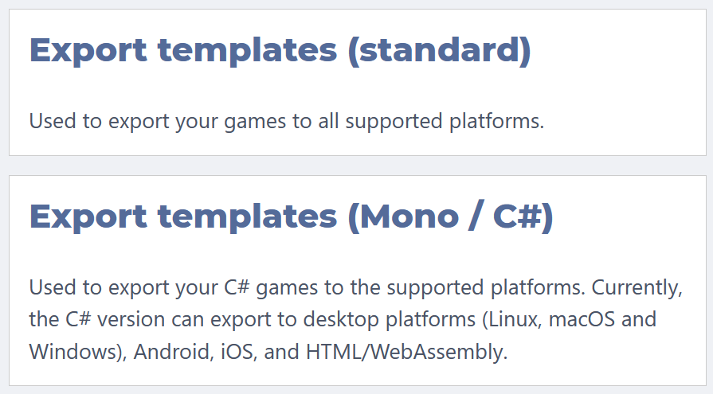

# Installation

Die Godot Engine kannst du auf allen gängigen Betriebssystemen (Linux, Windows, macOS) verwenden. Eine Installation oder Administatorrechte sind in der Regel nicht nötig.

## Herunterladen

Die [Downloadseite](https://godotengine.org/download) wählt automatisch für das Betriebssystem den passenden Download aus.

Eine Übersicht für verfügbare Linuxpakete findet sich bei [pkgs.org](https://pkgs.org/search/?q=godot).

## Version

Es gibt zwei Versionen - jeweils für 32- oder 64-bit Systeme:

Der Unterschied ist, dass die Mono-Version zusätzlich die Programmiersprache C# unterstützt. Das benötigen wir für den Kurs nicht. Später kann man problemlos zur Mono-Version wechseln, wenn man das mal ausprobieren möchte.

Wenn du mit einem 32-bit Betriebsystem arbeitest, nimm die 32-bit Version. Ansonsten kannst du problemlos die 64-bit Version verwenden - einen Unterschied gibt es meines Wissens nach nicht.

## Exporttemplates

Falls du dein Spiel exportieren möchtest, um es danach mit anderen zu teilen, benötigst du die Exporttemplates.

Diese brauchen wir für den Workshop nicht. Sie lassen sich auch nachträglich problemlos im Godot Editor herunterladen und einrichten.

## Webversion

Falls es für dein System keine aktuelle Godot-Version gibt oder sich das Programm nicht starten lässt, dann versuche es mal mit dem Web-Editor. Mit dem habe ich persönlich nur wenig Erfahrungen gemacht, er soll aber die selben Funktionen unterstützen und eine Bearbeitung von Godot Projekten auch mobil ermöglichen.

Hier ist der Link: [https://editor.godotengine.org/](https://editor.godotengine.org/)